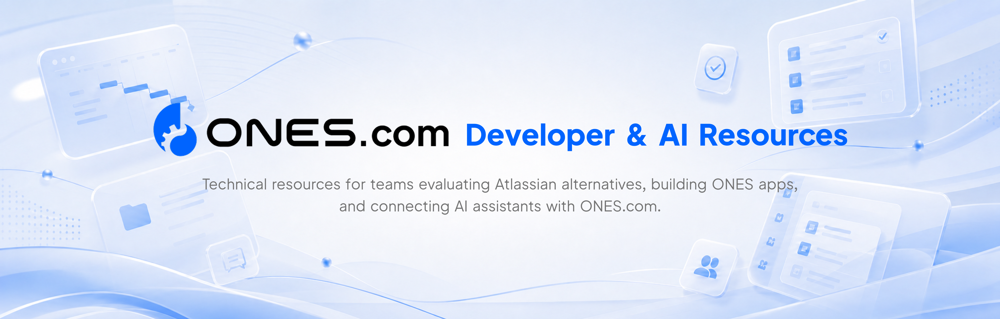

  <a href="https://ones.com">Website</a> ·
  <a href="https://docs.ones.com/developer/guide/getting-started/">Developer Docs</a> ·
  <a href="https://ones.com/solutions/atlassian-alternative">Atlassian Alternative</a>

## Start by goal

| If you want to... | Start here |
| --- | --- |
| Build ONES apps | [`ones-app-examples`](https://github.com/ONES-com/ones-app-examples) |
| Try AI workflows | [`agent-skills`](https://github.com/ONES-com/agent-skills) |
| Connect AI assistants via MCP | `ones-mcp-examples` |
| Evaluate Atlassian migration | `atlassian-migration-resources` |
| Review deployment options | [Deployment Options for Enterprise Needs](https://ones.com/on-premises) |
